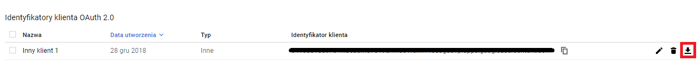

# librus-synchro
Skrypt umożliwiający sychnronizację e-dziennika librus z kalendarzem google.

## Wymagania
- [librus-api-python](https://github.com/synnek1337/librus-api-python)
- [requests-html](https://html.python-requests.org)
- [google-api-python-client](https://pypi.org/project/google-api-python-client/)
- [oauth2client](https://pypi.org/project/oauth2client/)

## Użycie
### Instalacja zależności
```pip install -r requirements.txt```

### Utworzenie projektu z wykorzystaniem API od Google
- Otwórz [konsolę API Google](https://console.cloud.google.com/apis/dashboard)
- Kliknij ```utwórz projekt```
- Wprowadź dowolną nazwę i naciśnij ```utwórz```

### Pobranie danych logowania do API
- Przejdź [tutaj](https://console.cloud.google.com/apis/credentials)
- Naciśnij ```Utwórz dane logowania```
- Z rozwiniętej listy wybierz ```ID klienta OAuth```
- Zaznacz ```Inne``` oraz wprowadź dowolną nazwę, a następnie naciśnij ```Utwórz```
- Zamknij okno dialogowe które wyskoczyło przed chwilą
- Pobierz dane logowania do folderu z tym repozytorium i zmień nazwe na ```credentials.json```


### Wprowadzenie danych logowania do librusa do konfiguracji skryptu
- Otwórz plik ```config.cfg``` w swoim ulubionym edytorze
- Reszty chyba nie muszę tłumaczyć :)

### **Teraz wystarczy ```python main.py```, jeśli chcesz, możesz dodać skrypt do crona**
## Podziękowania
- [findepi](https://github.com/findepi) za stworzenie scrappera do librusa
- [google](https://github.com/google) for creating Google Calendar
- [googleapis](https://github.com/googleapis) for creating Google Calendar API library
- [kennethreitz](https://github.com/kennethreitz) for creating requests-html